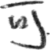

# Inception Module 기반의 한자 손글씨 분류 모델 제작
### (Handwritten Chinese Character Recognition with Inception Module)
CASIA HWDB 1.1 데이터를 이용하여 3755개의 한자를 인식하는 모델을 제작.

클래스 수가 많아 기존의 CNN으로 모델을 구축하게 되면 파라미터 수가 급격히 늘어남.

GoogLeNet에서 처음 공개된 Inception Module을 이용하면 파라미터 수는 줄이고, 모델을 깊게 구축할 수 있음.

## Dataset
CASIA HWDB 1.1 Offline Database를 이용했습니다. (<a href="http://www.nlpr.ia.ac.cn/databases/handwriting/Download.html">링크</a>)

|데이터 셋 명|클래스 수|이미지 크기|데이터 개수|데이터 셋 크기|
|---------| :--------: |----------|----|-----|
| CASIA HWDB 1.1 | 3755 | 64 X 64 픽셀 | **Train** : 897,758 / **Test** : 223,991 | **Train** : 1.9GB / **Test** : 0.4GB |

### Example
|||||
| :---------: | :--------: | :--------: | :----: |
| **可** | **干** | **古** | **介** |

## Data Preprocessing
CASIA HWDB 1.1 데이터 포맷이 .gnt 파일이라서 이것을 학습이 가능한 포맷으로 바꿔줘야 한다.
.gnt 파일의 데이터들을 64 X 64 px의 .png 파일로 변환해 ./database에 저장했다.
그러기 위해서는 gnt2png.py을 실행시켜 ./database에 데이터를 만들어준다.

#### 정확도

#### 손실 함수 값

## Model
"한글 인식을 위한 CNN 기반의 간소화된 GoogLeNet 알고리즘 연구" 에서 영감을 받아, CNN 구조를 설계했습니다.

모바일 서비스로 제공할 모델이기 때문에, 기존의 GoogLeNet을 간소화시켜 모델을 학습시켰습니다.

총 3개의 인셉션 모듈을 사용해 모델을 구축했고, 모델의 경량화를 목적으로 제작했습니다.

(작성중...)
