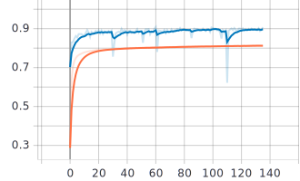

# Inception Module 기반의 한자 손글씨 분류 모델 제작
### (Handwritten Chinese Character Recognition with Inception Module)

CASIA HWDB 1.1 데이터를 이용하여 3755개의 한자를 인식하는 모델을 제작.

클래스 수가 많아 기존의 CNN으로 모델을 구축하게 되면 파라미터 수가 급격히 늘어남.

GoogLeNet에서 처음 공개된 Inception Module을 이용하면 파라미터 수는 줄이고, 모델을 깊게 구축할 수 있음.

## Dataset
CASIA HWDB 1.1 Offline Database를 이용했습니다. (<a href="http://www.nlpr.ia.ac.cn/databases/handwriting/Download.html">링크</a>)

|데이터 셋 명|클래스 수|데이터 개수|데이터 셋 크기|
|---------| :--------: |----------|----|
| CASIA HWDB 1.1 | 
3755
 | **Train** : 897,758장 / **Test** : 223,991장 | **Train** : 1.9GB / **Test** : 0.4GB |

## Data Preprocessing
데이터 포맷이 .gnt 파일이라서 이것을 .png처럼 학습이 가능한 파일로 바꿔줘야 한다.
그러기 위해서는 gnt2png.py을 실행시켜 ./database에 데이터를 만들어준다.

(작성중...)

#### 정확도

#### 손실 함수 값

